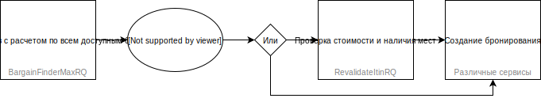
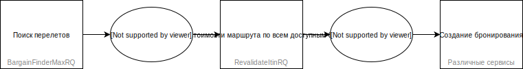

# Брендированные тарифы

-----

**Оглавление:**
<!-- toc -->

-----

## Введение

Многие перевозчики предлагают различный набор услуг и условий перелета для разных тарифов, которые объединены в группы или *бренды* в зависимости от уровня предоставляемых услуг и условий перелета. Такие тарифы называются *брендированными*.

На портале [Air Merchandising](https://www.sabretravelnetwork.com/airmerchandising) доступен список перевозчиков, поддерживающих брендированные тарифы.

При работе с Sabre APIs существует два основных алгоритма работы с брендированными тарифами, при которых выбор брендов осуществляется сразу в результатах поиска или в отдельном запросе после выбора перелета в результатах поиска.

## Выбор брендов в результатах поиска

В этом случае [расчет по всем доступным брендам](shop.md#raschet_stoimosti_po_vsem_dostupnim_brendam) запрашивается непосредственно в результатах поиска, и пользователь выбирает нужный бренд (или бренды) в поисковой выдаче. После этого можно приступать к [проверке стоимости и наличия мест](revalidate-itinerary.md) или сразу к [созданию бронирования](create-booking.md).

Схематичное изображение алгоритма:



## Выбор бренда после выбора перелета в результатах поиска

В этом случае в результатах поиска запрашивается расчет по самому дешевому тарифу, пользователь выбирает в поисковой выдаче нужный маршрут, после чего отправляется запрос на [расчет стоимости маршрута по всем доступным брендам](revalidate-itinerary.md#raschet_stoimosti_po_vsem_dostupnim_brendam), в результате которого пользователь выбирает нужный бренд (или бренды). После этого можно приступать к [созданию бронирования](create-booking.md).

Схематичное изображение алгоритма:



## Создание бронирований

Вне зависимости от использованного алгоритма выбора брендов, он (или они) должны быть указаны при [создании бронирования](create-booking.md) в момент расчета стоимости. Информация о выбранном пользователем бренде (или брендах) сохраняется в момент создания бронирования в масках расчета (PQ) и затем должна быть указана в запросах каждый раз при [перерасчете стоимости](reprice-booking.md) бронирования. Поэтому рекомендуется хранить информацию о выбранном бренде или брендах в виде ремарок в бронировании.

*Обратите внимание на то, что разные бренды для одних и тех же рейсов могут соответствовать разным классам бронирования.*

## Список услуг у брендированных тарифов

Получить список услуг у каждого брендированного тарифа (т.е. фактически показать различия между различныыми брендами перевозчика) можно при поиске перелетов при помощи сервиса [BargainFinderMaxRQ](shop.md), при проверки стоимости и наличия мест или расчете стоимости по всем доступным брендам при помощи сервиса [RevalidateItinRQ](revalidate-itinerary.md), а также при поиске вариантов перелета для обмена при помощи сервиса [ExchangeShoppingRQ](shop-exchange-ticket.md).

Любой из этих сервисов вернет список всех услуг, которые перевозчик решил отметить для выбранного бренда. Для каждой услуги будет указано:
- ```Application``` — код применимости услуги. Возможные варианты:
    - ```F``` — услуга предоставляется бесплатно
    - ```N``` — услуга не предоставляется
    - ```C``` — услуга предоставляется платно
    - ```D``` — услуга отображается, но не предоставляется (например, чтобы продемонстрировать, что она будет в более дорогом бренде)
- ```CommercialName``` — название услуги
- ```ServiceGroup``` — категория услуги из справочника [субкодов ATPCO](https://www.atpco.net/sites/atpco-public/files/all_pdfs/Opt_Scvs_Industry_Sub_Codes_Online_C.pdf)
- ```SubCode``` — субкод услуги из справочника [субкодов ATPCO](https://www.atpco.net/sites/atpco-public/files/all_pdfs/Opt_Scvs_Industry_Sub_Codes_Online_C.pdf)
